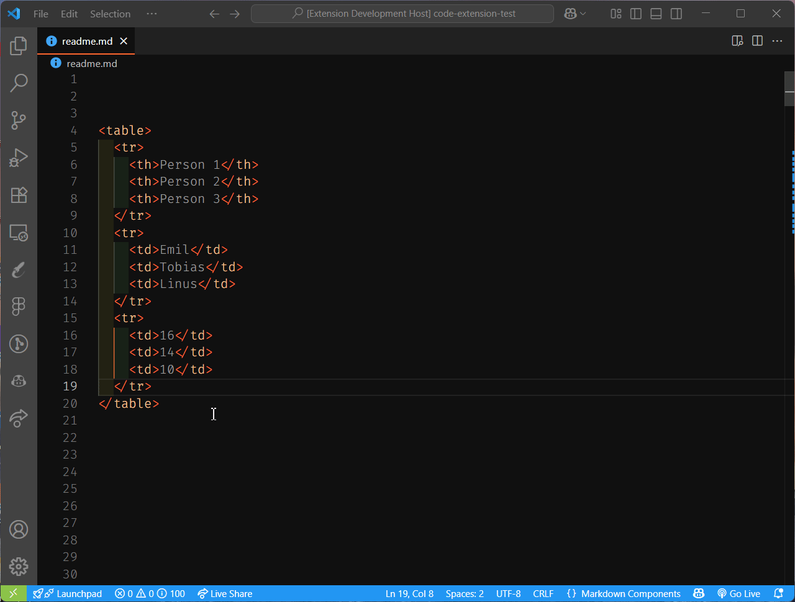
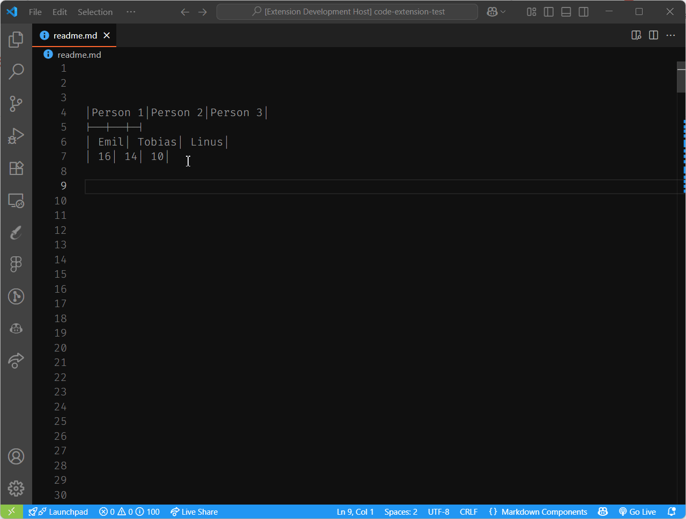

# HTML Table to Markdown

This extension converts HTML tables to Markdown format, and formats them for easy readability in Visual Studio Code.

## Features

Convert HTML tables to Markdown format. Use the command palette `HTML table to Markdown: Convert` to convert the selected HTML table into Markdown format, or simply use the keyboard shortcut <kbd>Ctrl</kbd>+<kbd>Alt</kbd>+<kbd>T</kbd> on Windows and <kbd>Cmd</kbd>+<kbd>Alt</kbd>+<kbd>T</kbd> on macOS.

Format Markdown tables for better readability. Use the command palette `HTML table to Markdown: Format` to format the selected Markdown table, or use the keyboard shortcut <kbd>Ctrl</kbd>+<kbd>Alt</kbd>+<kbd>M</kbd> on Windows and <kbd>Cmd</kbd>+<kbd>Alt</kbd>+<kbd>M</kbd> on macOS.

The underlining logic is provided by [markdown-table-prettify](https://www.npmjs.com/package/markdown-table-prettify) npm package. All credits go to the original author of the package.

## Contribution
Contributions are welcome! Please feel free to submit a pull request or open an issue for any enhancements or bug fixes. Before creating a new issue, please check the current list as you might find out that you don't need to create one. Please include as many details as possible in your issue.

## Code contribution

If you would like to contribute code to this project, please link it to an issue or create a new one. Before submitting a pull request, please ensure that your code adheres to the project's coding standards and passes all tests.

All code must be integrated via pull requests. Please ensure that your pull request includes a clear description of the changes made and any relevant issue numbers.
